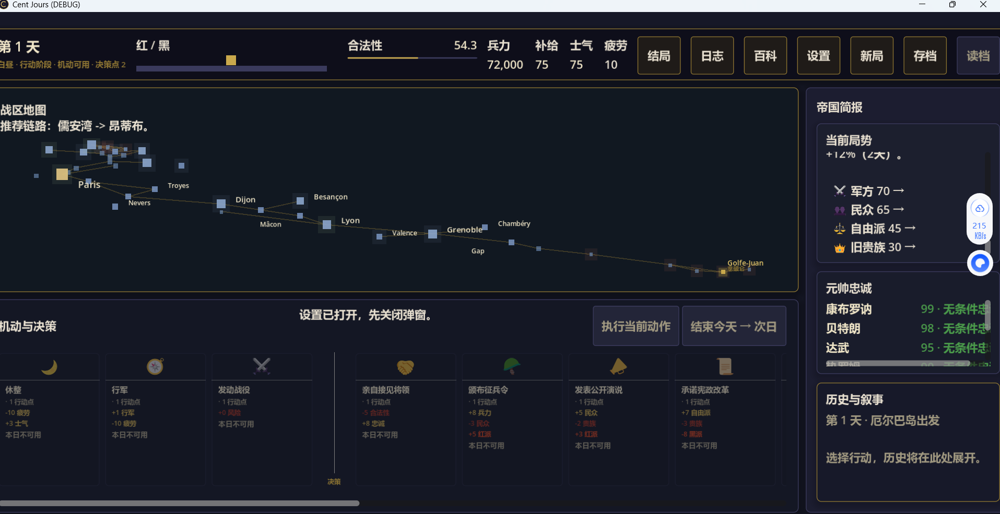
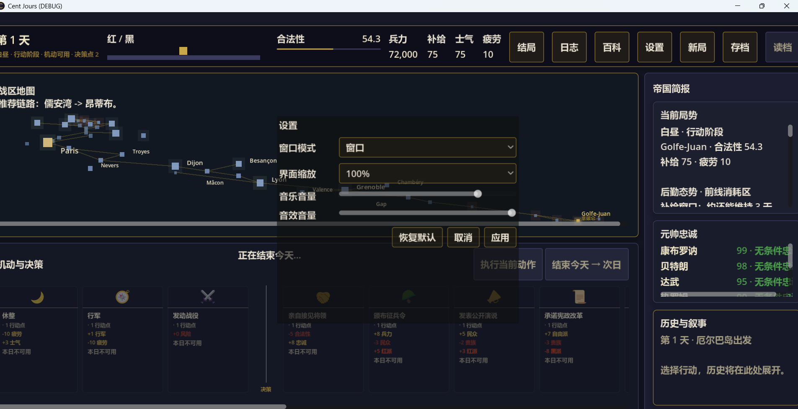
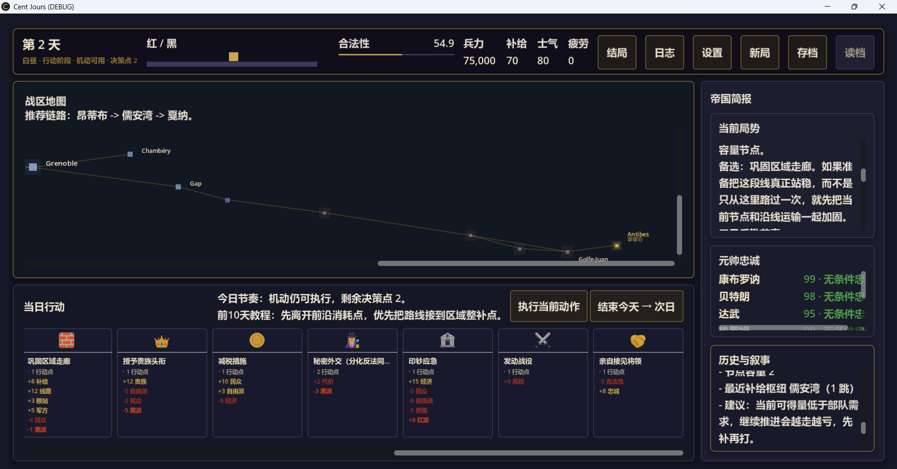
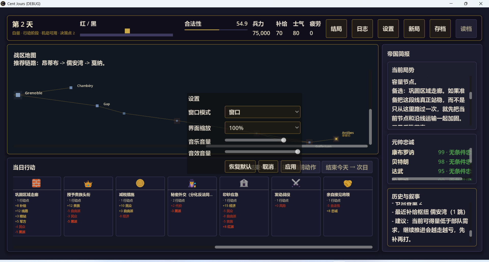
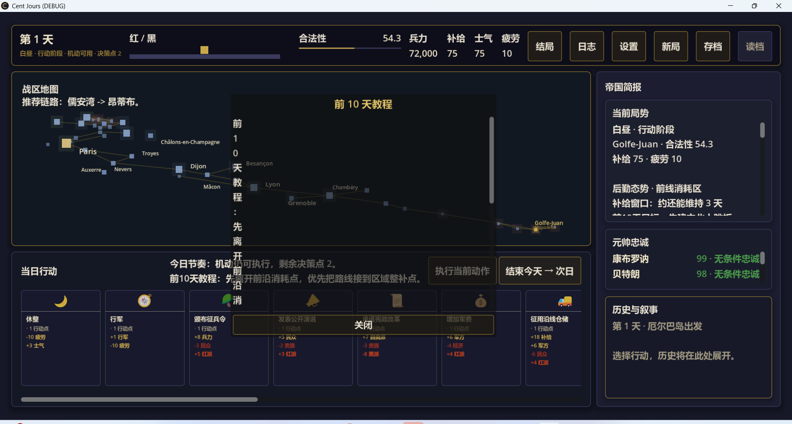
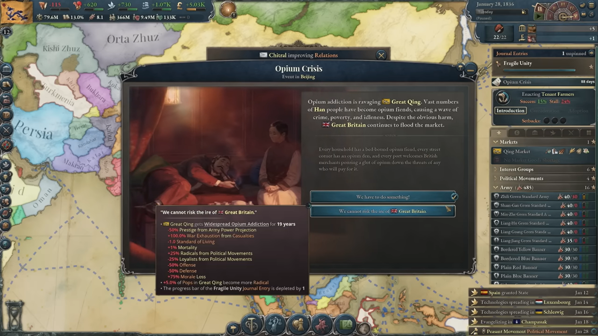
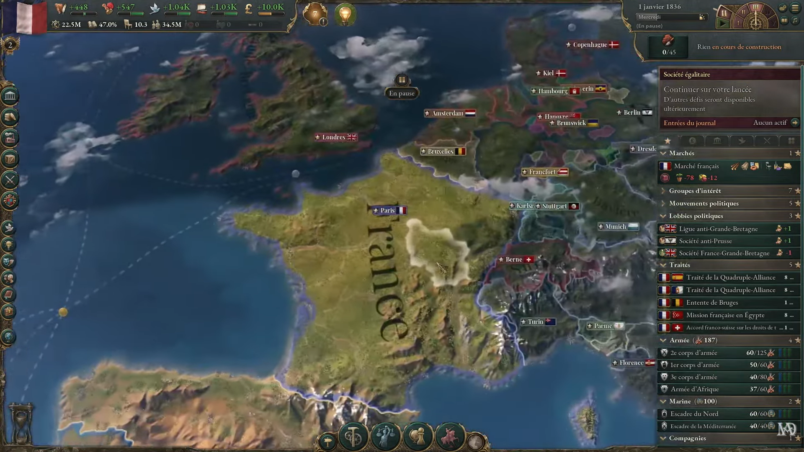
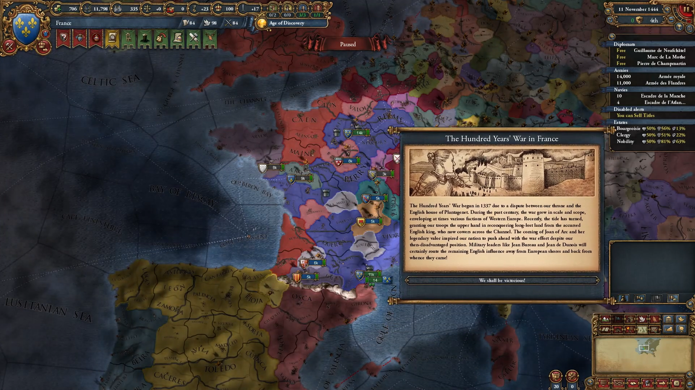
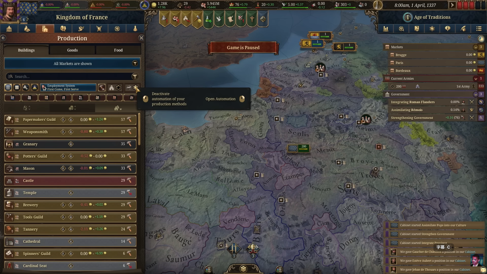
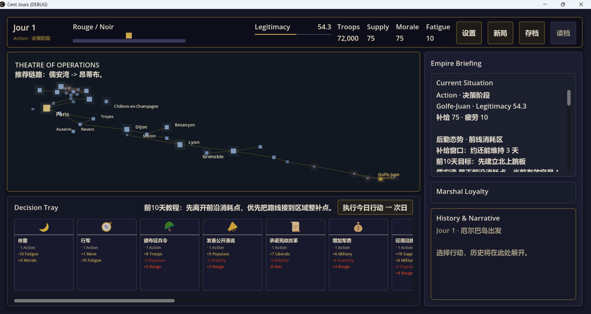

# 2026-03-29

本文档为人类真实反馈，只有人类可以修改
带感叹号符号的为高优先级

## 05

如果直接点击空白处也会关闭设置，百科等弹窗，结果政策按钮依然灰掉

## 04

（开发者视角）

点击设置后画面中间的文本变成正在结束今天，按钮全灰。你为什么总犯这种低级错误，是前端架构有问题吗？不能再在这种小毛病上拖累开发节奏了
详细说明红与黑指数的影响，以及如何提高政治合法性

## 03

- 有时候点击空白页面消不掉地图节点弹窗
- 没有行动点后应该政策按钮全灰；行军和其他政策应该分离排版
- 点击设置按钮弹出界面后UI大小会变化
  
  
- 红黑指数是什么意思有什么用，怎么增加合法性，应该有一个内置游戏百科

## 02

## 

教程文本变成竖的了，为什么总犯这个bug，能否用测试保证不再犯同类错误

## 01

- ！每天只能执行一个政策不合理，应该至少一次行军＋2到3次决策
- 事件和教程建议做成弹框，玩家可以选择关闭后，留在专门的日志中，可重复打开
- ！怎么达成各种结局，应有专门的按钮可以点击查看
- 当前UI排版过大，地图过小，参考P社游戏，地图铺满整个屏幕，UI只保留小图标按钮，点击时分别出现详情，然后可再点击关闭
- ！当前是中文玩家试玩，所有文本做成全中文版本，后续再考虑多语言
- UI参考，以维多利亚3为主参考，把参考图也重命名后放到reference_materials：
  
  
  
  

- 当前实际画面：
  
