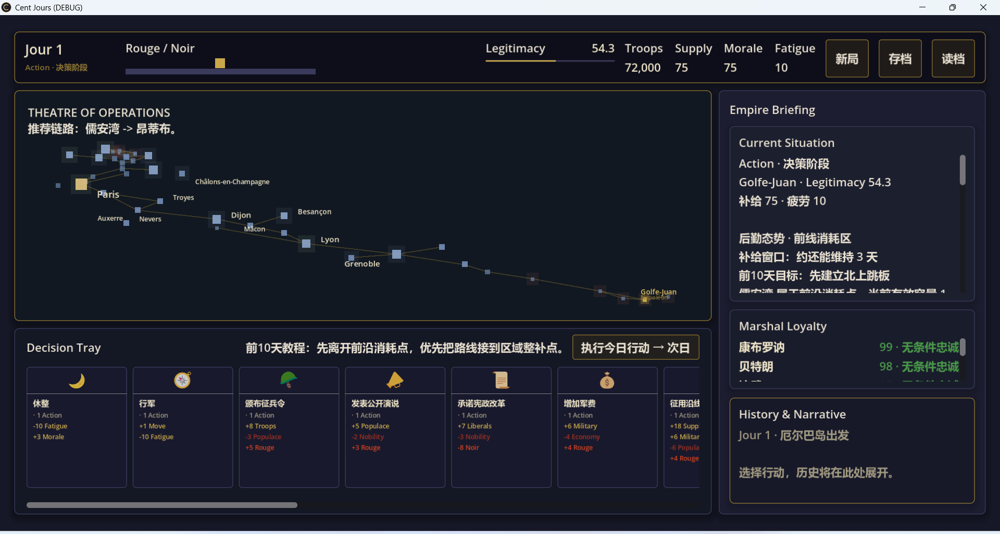
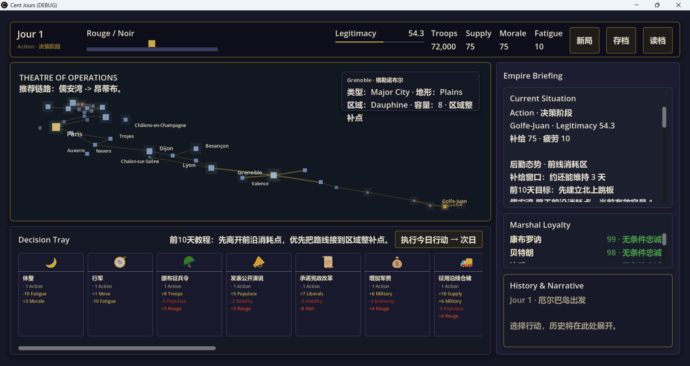
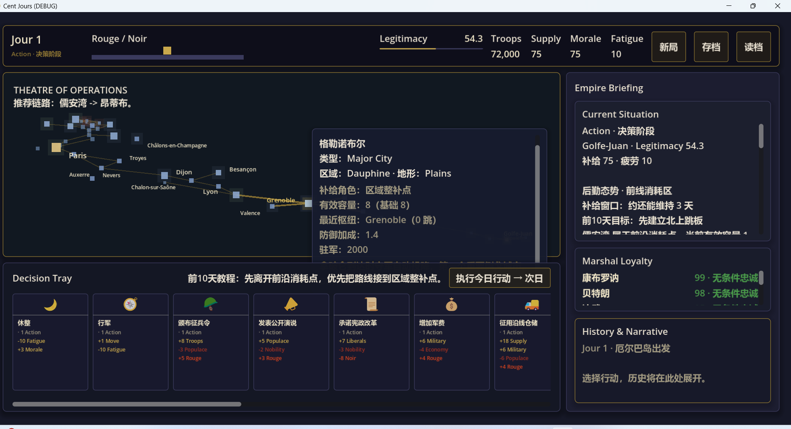
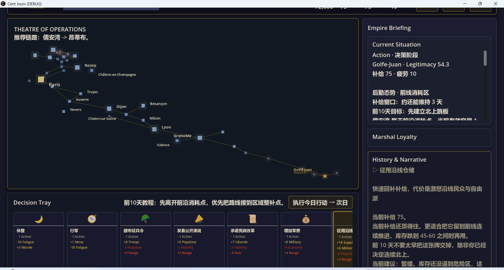
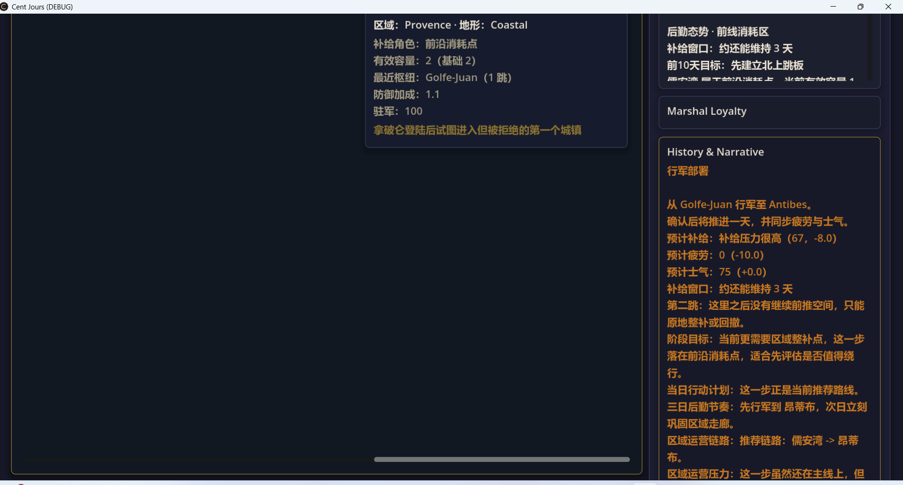
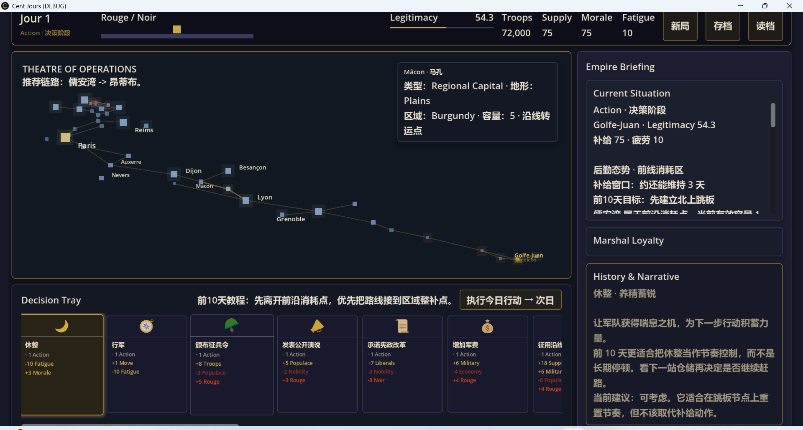
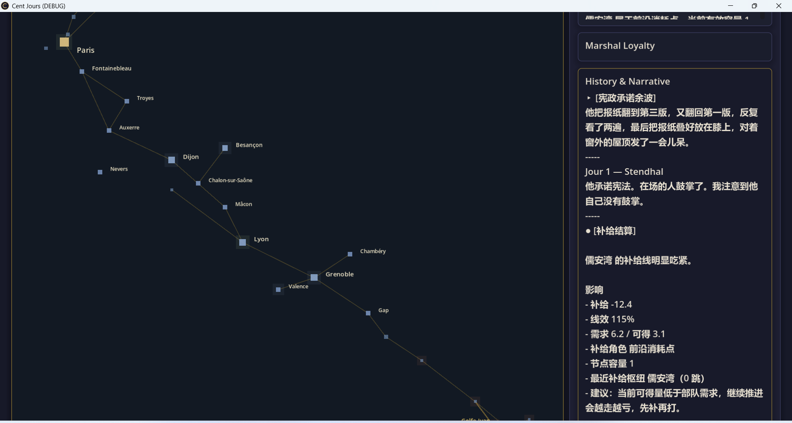

# 起始页面

# bug01:悬停框

悬停框无法覆盖全部悬停文字；

点击地图节点后无法看到最下面的文字;悬停和点击的悬浮框位置变了太突兀，要求在同一个位置

# bug02：存档读档

点击存档/读档后godot报错：Invalid access to property or key 'theme_override_constants' on a base object of type 'VBoxContainer'.

# bug03：页面自动放大超出屏幕

## 点击征用沿线仓储政策后

## 点击行军政策，点击昂蒂布地图节点后

## 点击休整政策后

## 点击承诺宪政改革政策后

# 机制问题

当前游戏一回合能执行几个政策？
合理的设计应该是一个执行行动按钮，一个进入下一回合按钮，但是好像目前不是这样的？

# 总结反思

**分析总结为什么codex开发这么多Bug，是否开发规则需要优化**

以下为建议：

## 站在测试工程师角度思考

- Rust 属性测试➕项目集成测试加入github ci，本地只跑单元测试

## 站在架构师角度思考

- 项目耦合程度
- 有无重构必要

## 禁止:

- speculative implementation
- implicit assumptions
- missing error handling

---

分析这些建议合理性，codex再主动思考更多可能遗漏的点，写成修复bug与规则优化的adr文档
根据文档生成完整的优化计划到dev_plan文档，以修复bug与规则优化为终点进行全自动开发
可以分成最多三轮进行，不完成目标不允许停下来写final总结
